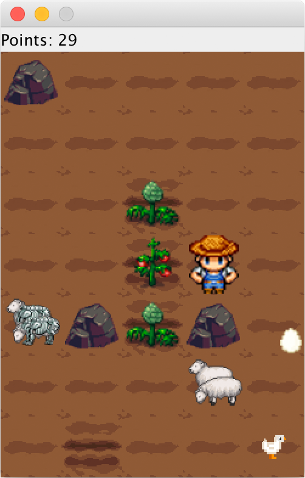

## Farm Simulator

  

### [Enunciado do projeto](others/enunciado_v2.0.pdf)

### Introdução

O trabalho final consiste em criar um simulador de uma plantação. As principais características deste
simulador são: tem dois tipos de culturas (tomate e couve), um agricultor, dois tipos de animais
(ovelhas e galinhas) e ovos. O objetivo do agricultor é amealhar pontos plantando, cuidando e
colhendo das culturas e simultaneamente não deixar as ovelhas ficar famintas. Colher plantas dá
pontos (tomate 3 pontos, couve 2 pontos), e são também atribuídos pontos em cada ciclo de jogo
(ver abaixo) em que as ovelhas estejam bem alimentadas (1 ponto por ciclo) e 2 pontos por
conseguir apanhar a galinha.

O agricultor é controlado pelas teclas de movimento (setas) e o pressionar do espaço indica que o
próximo "movimento" é uma acção sobre os objetos que estão nessa direcção. O agricultor pode
passar por cima de todos os tipos de terreno, e de todos os vegetais. No entanto, o agricultor, os
animais e o ovo não podem ocupar a mesma posição. Isto é, a mesma posição só pode ser ocupada
ou pelo agricultor, ou por um dos animais, ou por um ovo.
